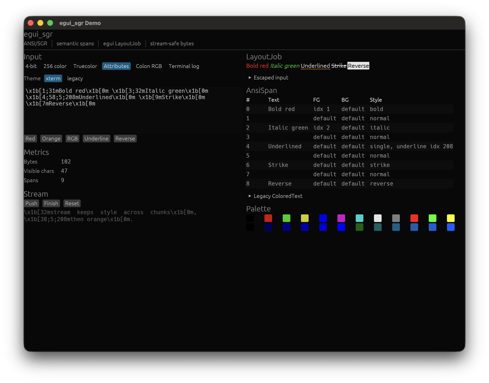

# egui_sgr

`egui_sgr` converts ANSI/SGR escape sequences into egui text. The main output is
`egui::text::LayoutJob`, which is the egui representation designed for one text
value with multiple styled sections.

## Install

```toml
[dependencies]
egui_sgr = "0.3"
```

## LayoutJob Usage

```rust
use egui_sgr::{ansi_to_layout_job, EguiAnsiTheme};

let theme = EguiAnsiTheme::default();
let job = ansi_to_layout_job(
    "normal \x1b[31mred\x1b[0m \x1b[38;5;208morange\x1b[0m",
    &theme,
);

ui.label(job);
```

`LayoutJob` is used because ANSI commonly changes style inside a single logical
string, and a single egui widget preserves wrapping and layout behavior.

## Streaming Usage

```rust
use egui_sgr::{AnsiSpanBuffer, EguiAnsiTheme};

let mut buffer = AnsiSpanBuffer::new();
buffer.push_bytes(b"\x1b[32mstream ");
buffer.push_bytes(b"keeps green");
buffer.push_bytes(b"\x1b[0m done");
buffer.finish();

let theme = EguiAnsiTheme::default();
ui.label(buffer.to_layout_job(&theme));
```

For lower-level control, use `AnsiStreamParser` directly:

```rust
use egui_sgr::AnsiStreamParser;

let mut parser = AnsiStreamParser::new();
let spans = parser.push_bytes(b"\x1b[31mred");
let tail = parser.finish();
```

The streaming API is synchronous and byte-oriented, so it can be connected to
`std::io`, process output, PTYs, async runtimes, or network streams by feeding
whatever chunks the caller receives.

## API Layers

- `ansi_to_spans` / `ansi_bytes_to_spans`: parse ANSI into semantic spans.
- `spans_to_layout_job`: render already parsed spans with an egui theme.
- `ansi_to_layout_job` / `ansi_bytes_to_layout_job`: one-call parse and render.
- `AnsiStreamParser`: incremental parser that preserves state across chunks.
- `AnsiSpanBuffer`: accumulates streamed spans and renders the full buffer.

For the full module design and API policy, see
[ARCHITECTURE.md](ARCHITECTURE.md).

## Supported SGR

- Reset: `0`, empty `CSI m`.
- 4-bit colors: `30..37`, `40..47`, `90..97`, `100..107`.
- Defaults: `39`, `49`, `59`.
- 8-bit colors: `38;5;n`, `48;5;n`, `58;5;n`.
- 24-bit colors: `38;2;r;g;b`, `48;2;r;g;b`, `58;2;r;g;b`.
- Colon forms: `38:2::r:g:b`, `38:2:r:g:b`, `38:5:n`, and related forms.
- Attributes: bold, faint, italic, underline, strikethrough, reverse, hidden.

This crate does not emulate a terminal screen. Cursor movement, clearing,
DCS, and OSC sequences are stripped by default.

## Themes

`EguiAnsiTheme::default()` uses a conventional xterm 256-color palette.
`EguiAnsiTheme::xterm()` is an explicit alias for the same default theme.

## Demo

Run the minimal API examples with:

```sh
cargo run --example layout_job
cargo run --example streaming
```

Run the egui demo with:

```sh
cargo run --example demo
```



## Benchmarks And Quality Gates

Parser, renderer, and streaming paths have Criterion benchmarks:

```sh
cargo bench --bench ansi
```

The release quality gate used by CI is:

```sh
cargo fmt -- --check
cargo check --all-targets
cargo test --all-targets
cargo test --doc
cargo clippy --all-targets -- -D warnings
cargo bench --bench ansi --no-run
cargo doc --no-deps
cargo package --allow-dirty
```
